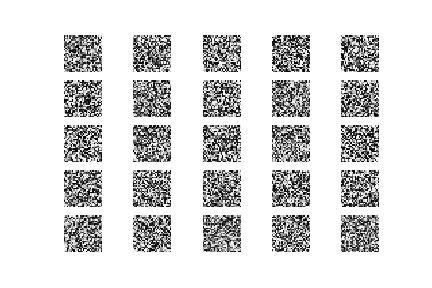
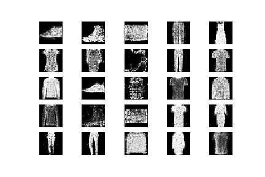

# fashion-GAN
Generate fashion images with a GAN from fashion MNIST dataset

Training a GAN from

 (epoch 0) 

to 

 (epoch 90000)

At the end two sample images are generated, a t-shirt and a shoe. Not fully satisfactory, but training a GAN is really difficult...

Sample python notebook showing GAN on fashion MNIST dataset. This is the homework assignment of the 6th week for [Siraj Raval course](https://www.machinelearningcourse.io/courses/make-money).
